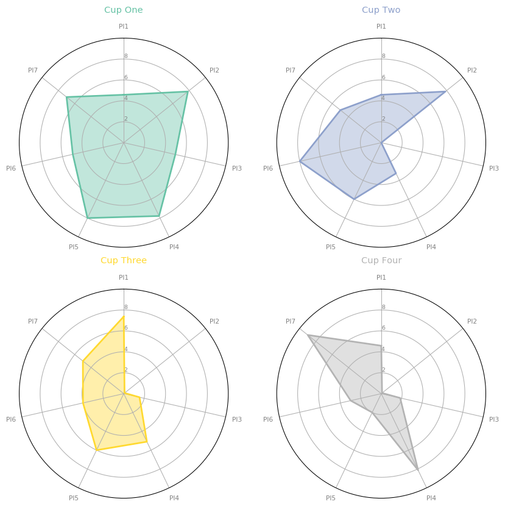

# CoffeeCupSimulator
Python Simulator to Evaluate Coffee Cup Design Performance 
Place Holder

## Coffee Cup Design Performance Visualizer

## Simulated Coffee Temperature Profile for Each Design Scenario

## Framework

## Heat Transfer Around Coffee Cup

