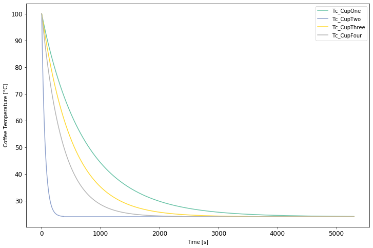

# CoffeeCupSimulator
Python Simulator to Evaluate Coffee Cup Design Performance 
Place Holder

## Framework

## Coffee Cup Design Performance Visulizer

## Simulated Coffee Temperature Profile for Each Design Scenario

